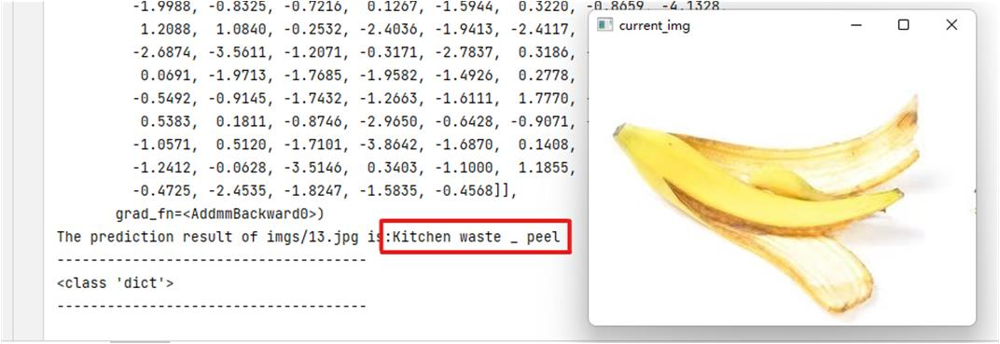
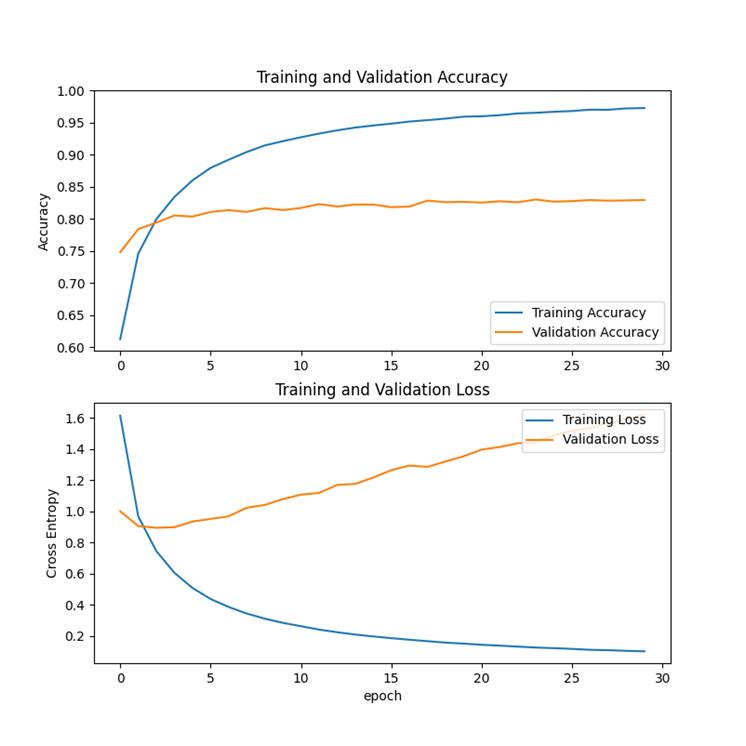

# MobileNetV2 based garbage sorting program
The task of classification is a basic task in computer vision tasks, which is relatively simple. As long as we find a suitable dataset, it is not difficult to build a model for garbage classification. Here I found a dataset on garbage classification, which has four major categories and 245 subcategories, the major categories are food waste, recyclables, other garbage and hazardous waste, and the subcategories are mainly specific categories of garbage, fruit peels, cardboard boxes, etc.

For your convenience, I have processed the dataset in advance, and you can use the code in utils.py to divide the original dataset into a training set, a validation set and a test set in proportion.


## Code Structure

```
trash1.0
├─ .idea idea   Configuration file
├─ imgs   Image files
├─ main_window.py    Graphical interface code
├─ models
│    └─ mobilenet_trashv1_2.pt
├─ old     Some deprecated code
├─ readme.md    What you see now
├─ test.py     Test files
├─ test4dataset.py      Test all datasets
├─ test4singleimg.py     Testing a single image
├─ train_245_class.py      Training Code
└─ utils.py      Tool class for dividing data sets
```

## Training

Before training, please execute the command to follow the required dependencies for the project.


```cmd
conda create -n torch1.6 python==3.6.10
conda activate torch1.6
conda install pytorch torchvision cudatoolkit=10.2 # GPU(可选)
conda install pytorch torchvision cpuonly
pip install opencv-python
pip install matplotlib
```

First, you need to download the dataset and unzip it, remember the unzip path, and modify the dataset path to your local dataset path in line 18 of `train_245_class.py`, then run the file to start the model training.

Mobilenet is a relatively lightweight network that can run very fast on a CPU. The training code is as follows: first, the dataset is loaded through the dataloader of pytorch, and the pre-trained mobilenet is loaded for fine-tuning.


## Testing

After the model is trained, the model can be tested. The `test4dataset.py` file is mainly for testing the dataset, that is, all the files in the test directory after unpacking, then the `test4singleimg.py` file is mainly for testing a single image.

Considering that you may want to save the training process, so I put my trained model under the models directory, you can directly use my trained model for testing, the current accuracy on the test set is about 82%, not very high, but enough to use.

The following is the code for some of the tests:

```
# from train import load_data
from PIL import ImageFile
import torch
import os
from torchvision import transforms, datasets
import numpy as np
from torch.utils.data import Dataset
device = torch.device("cuda:0" if torch.cuda.is_available() else "cpu")
print(device)
# Some images have incomplete information and cannot be read, skip these images
ImageFile.LOAD_TRUNCATED_IMAGES = True
np.set_printoptions(suppress=True)

# todo
def load_test_data(data_dir="D:/code/trash_jpg_renamed_new"):
    data_transforms = {
        'val': transforms.Compose([
            transforms.RandomResizedCrop(224),
            transforms.RandomHorizontalFlip(),
            transforms.ToTensor(),
            transforms.Normalize([0.485, 0.456, 0.406], [0.229, 0.224, 0.225])
        ]),
        'test': transforms.Compose([
            transforms.Resize(256),
            transforms.CenterCrop(224),
            transforms.ToTensor(),
            transforms.Normalize([0.485, 0.456, 0.406], [0.229, 0.224, 0.225])
        ]),
    }

    image_datasets = {x: datasets.ImageFolder(os.path.join(data_dir, x),
                                              data_transforms[x])
                      for x in ['val', 'test']}
    dataloaders = {x: torch.utils.data.DataLoader(image_datasets[x], batch_size=32,
                                                  shuffle=True, num_workers=0)
                   for x in ['val', 'test']}
    dataset_sizes = {x: len(image_datasets[x]) for x in ['val', 'test']}
    class_names = image_datasets['test'].classes
    return dataloaders, dataset_sizes, class_names


def test_test_dataset(model_path="models/mobilenet_trashv1_2.pt"):
    # Loading Models
    net = torch.load(model_path, map_location=lambda storage, loc: storage)
    dataloaders, dataset_sizes, class_names = load_test_data()
    testloader = dataloaders['test']
    test_size = dataset_sizes['test']
    net.to(device)
    net.eval()
    # Test the accuracy of all
    correct = 0
    total = 0
    with torch.no_grad():
        for data in testloader:
            images, labels = data
            images, labels = images.to(device), labels.to(device)
            outputs = net(images)
            _, predicted = torch.max(outputs.data, 1)
            total += labels.size(0)
            correct += torch.sum(predicted == labels.data)
    correct = correct.cpu().numpy()
    print('Accuracy of the network on the %d test images: %d %%' % (test_size,
                                                                    100 * correct / total))


def test_test_dataset_by_classes(model_path="models/mobilenet_trashv1_2.pt"):
    # Loading Models
    net = torch.load(model_path, map_location=lambda storage, loc: storage)
    dataloaders, dataset_sizes, class_names = load_test_data()
    testloader = dataloaders['test']
    test_size = dataset_sizes['test']
    net.to(device)
    net.eval()
    classes = class_names
    # Test the accuracy of each category
    class_correct = list(0. for i in range(len(class_names)))
    class_total = list(0. for i in range(len(class_names)))
    with torch.no_grad():
        for data in testloader:
            images, labels = data
            images, labels = images.to(device), labels.to(device)
            outputs = net(images)
            _, predicted = torch.max(outputs, 1)
            c = (predicted == labels).squeeze()
            for i in range(len(labels)):
                label = labels[i]
                class_correct[label] += c[i].item()
                class_total[label] += 1
    for i in range(len(class_names)):
        print('Accuracy of %5s : %2d %%' % (
            classes[i], 100 * class_correct[i] / class_total[i]))


if __name__ == '__main__':
    print('Performance of the model on the entire data set：')
    test_test_dataset()
    print('Model performance on each category：')
    test_test_dataset_by_classes()
```

The test results for a single image are as follows：



The results of accuracy versus loss function for the training and validation sets are visualized in the following figure：



